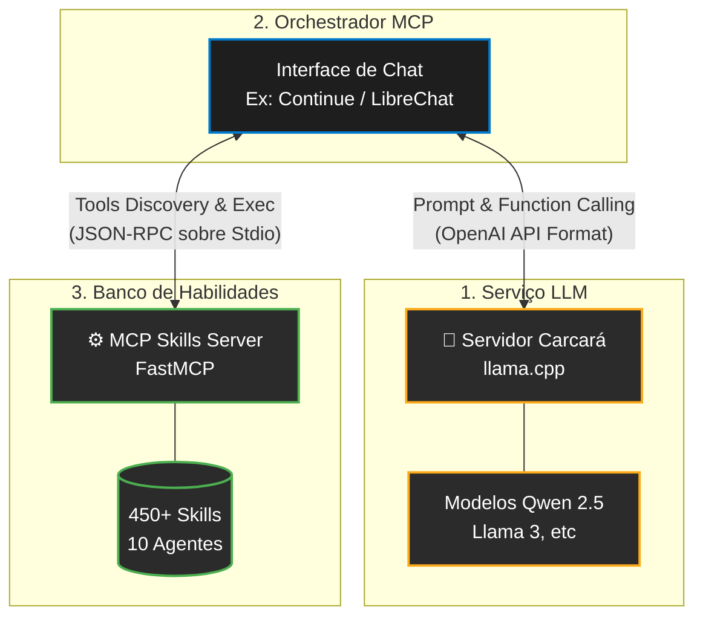

# 🦅 Arquitetura Carcará + MCP Skills Server

Este documento detalha o ciclo de arquitetura **100% offline e privada**, conectando o serviço provedor de inteligência artificial (**Carcará**) ao servidor de capacidades locais (**MCP Skills Server**).

Esta integração transforma modelos rodando localmente na sua máquina em agentes ativos, capazes de descobrir, ler e executar as mais de 450 habilidades de bioinformática, desenvolvimento e pesquisa.

---

## 🏗 Visão Geral da Arquitetura



---

## 🔄 O Ciclo de Vida do Prompt

O que realmente acontece quando você manda uma mensagem do tipo *"Usando a skill de Python, refatore esse script"*?

### Passo 1: Descoberta de Ferramentas
1. O **Cliente MCP** (ex: Extensão Continue no VS Code) inicializa o **MCP Skills Server** localmente num subprocesso `stdio`.
2. O servidor MCP publica que possui as seguintes ferramentas: `search_skills`, `get_skill`, `list_agents`, `get_agent`, etc.
3. Toda essa bagagem de ferramentas é serializada e enviada pelo Cliente em formato de *"Tool Calling Definitions"* nativos da API (formato OpenAI) para o servidor **Carcará**.

### Passo 2: Raciocínio (Carcará LLM)
1. O **Carcará** recebe seu prompt junto com a lista de ferramentas que ele "sabe usar".
2. Como o Qwen 2.5 possui ótimo fine-tuning nativo para Function Calling, a rede neural decide que não sabe fazer isso de cabeça, e decide disparar a ferramenta `search_skills("Python")`.
3. O servidor **Carcará** suspende o processamento de texto e retorna um comando JSON pedindo a execução da ferramenta.

### Passo 3: Execução (MCP)
1. O **Cliente MCP** intercepta esse pedido de ferramenta feito pelo Carcará e o converte para o formato interno do protocolo MCP.
2. O **MCP Skills Server** executa o código Python real na sua máquina (ex: buscando as skills) e retorna o conteúdo do `SKILL.md` (como usar Python Clean Architecture).
3. O **Cliente MCP** pega o conteúdo do Markdown e o devolve ao **Carcará** na mesma thread contextual (como uma mensagem de sistema tipo `"tool_result"`).

### Passo 4: Geração Final
1. O **Carcará** recomeça seu raciocínio, agora turbinado com a diretriz do agente Python lida do disco rígido.
2. O código ou texto é finalmente cuspido para você na tela.

---

## 🛠 Requisitos para Configuração

Para replicar este ecossistema na sua máquina, três engrenagens precisam se encaixar:

### 1. O Servidor Carcará (Inferência LLM)
Você executa seu LLM (como o Qwen 2.5 Coder) garantindo que o servidor subjacente emule o estilo OpenAI. 
Com o `llama.cpp` o comando base seria:
```bash
./llama-server -m modelos/qwen-2.5-coder-7b-instruct.gguf --port 8080 --host 127.0.0.1
```
*Isto inicia o provedor "Carcará" escutando em `http://127.0.0.1:8080/v1`.*

### 2. O MCP Skills Server
Você deve garantir que este repositório possui seu ambiente isolado:
```bash
cd /caminho/para/mcp
python3 -m venv .venv
source .venv/bin/activate
pip install fastmcp pyyaml
```

### 3. O Cliente Conector (Exemplo: Continue.dev no VS Code)
Edite a configuração do cliente para abraçar as duas extremidades:

**A. Enxergando o Carcará:**
```json
"models": [
  {
    "title": "Carcará (Qwen Local)",
    "provider": "openai",
    "model": "qwen2.5",
    "apiKey": "vazio",
    "apiBase": "http://127.0.0.1:8080/v1"
  }
]
```

**B. Enxergando o MCP Server:**
```json
"mcpServers": {
  "skills-server": {
    "command": "/caminho/para/mcp/.venv/bin/python3",
    "args": ["/caminho/para/mcp/server/mcp_skills_server.py"],
    "env": {
      "PYTHONPATH": "/caminho/para/mcp/server"
    }
  }
}
```

---

## 🌟 O "Superpoder" dessa Arquitetura

Ao separar o Carcará (Geração de Texto) do MCP (Diretrizes e Skills da Vasta Base de Conhecimento), atingimos as seguintes vantagens:

1. **Privacidade Absoluta**: Nenhum código fonte ou artigo de laboratório vaza para a internet, tudo permuta entre binários de localhost.
2. **Atualização Modular Sem Treinamento**: Você não precisa fazer um "finetune" no Carcará para ele aprender sobre uma nova pipeline em NextJS ou sobre Bioinformática; É só jogar a documentação em arquivo na pasta `/skills` e ela vira habilidade imediata via Busca Semântica do MCP.
3. **Imunidade de Degradação de Contexto**: Apenas a Skill relevante pedida pelo usuário via RAG é repassada pelo Cliente pro Carcará, mantendo o consumo de memória baixo e raciocínio afiado.
